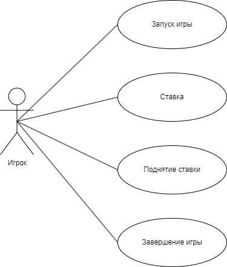

# Лабораторная работа 1
Диаграмма и описание прецедентов для игры "Красная собака"
---

## Прецедент "Запуск игры"
* Описание:
* Основной исполнитель:
* Предусловие:
* Постусловие:

## Прецедент "Ставка"
* Описание:
* Основной исполнитель:
* Предусловие:
* Постусловие:

## Прецедент ""
* Описание:
* Основной исполнитель:
* Предусловие:
* Постусловие:

## Прецедент "Поднятие ставки"
* Описание:
* Основной исполнитель:
* Предусловие:
* Постусловие:

## Прецедент "Завершение игры"
* Описание:
* Основной исполнитель:
* Предусловие:
* Постусловие:
