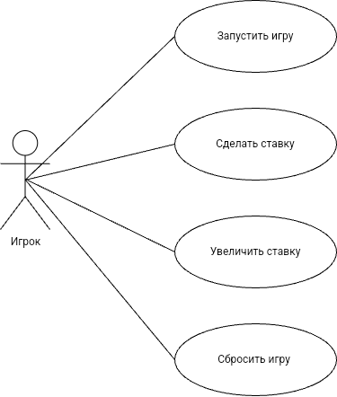

# Лабораторная работа 1
Диаграмма и описание прецедентов для игры "Красная собака"
---

## Прецедент "Запуск игры"
* **Описание:** Игрок запускает игру и вводит своё имя
* **Основной исполнитель:** Игрок
* **Предусловие:** Игра готова к запуску
* **Постусловие:** Переход к прецеденту "Ставка"

### Основной успешный сценарий:
|Пользователь|Система|
|-|--------|
|1. Игрок запускает приложение||
|2. Игрок вводит имя и начинает игру||
||3. Создается игра с указанным именем игрока|
||4. Начинается игровой процесс|
### Альтернативный сценарий "Некорректные данные":
|Пользователь|Система|
|-|--------|
|1. Игрок запускает приложение||
|2. Игрок не вводит имя и пытается начать игру||
||3. Выводится сообщение о незаполненном имени|
||4. Выполняется переход к шагу 1|

## Прецедент "Ставка"
* **Описание:** Игрок делает ставку в определенное число денег
* **Основной исполнитель:** Игрок
* **Предусловие:** Игрок ввел свое имя и начал игру
* **Постусловие:** Игроку открываются две карты

### Основной успешный сценарий:
|Пользователь|Система|
|-|--------|
|1. Игрок вводит размер своей ставки||
||2. Система сохраняет введенную ставку|
||3. Система открывает игроку две карты|
### Альтернативный сценарий "Не указан размер ставки":
|Пользователь|Система|
|-|--------|
|1. Игрок не указывает размер ставки||
||2. Выводится сообщение о необходимости указать размер ставки|
||3. Система предлагает игроку указать ставку|

## Прецедент "Поднятие ставки"
* **Описание:** Игрок увелчивиает ставку в размере первоначальной
* **Основной исполнитель:** Игрок
* **Предусловие:** На игровом столе выложены две карты
* **Постусловие:** Игроку открывается третья карта

### Основной успешный сценарий:
|Пользователь|Система|
|-|--------|
||1. Система предлагает игроку поднять ставку|
|2. Игрок поднимает ставку||
||3. Система сохраняет новый размер ставки|
||4. Система открывает игроку третью карту|
### Альтернативный сценарий "Ставка не поднимается":
|Пользователь|Система|
|-|--------|
||1. Система предлагает игроку поднять ставку|
|2. Игрок не поднимает ставку||
||3. Система открывает игроку третью карту|

## Прецедент "Завершение игры"
* **Описание:** После открытия третьей карты определяются результаты игры
* **Основной исполнитель:** Система
* **Предусловие:** На игровом столе выложены все три карты
* **Постусловие:** Определяются результаты игры

### Основной успешный сценарий:
|Пользователь|Система|
|-|--------|
|ляля|ляля|
